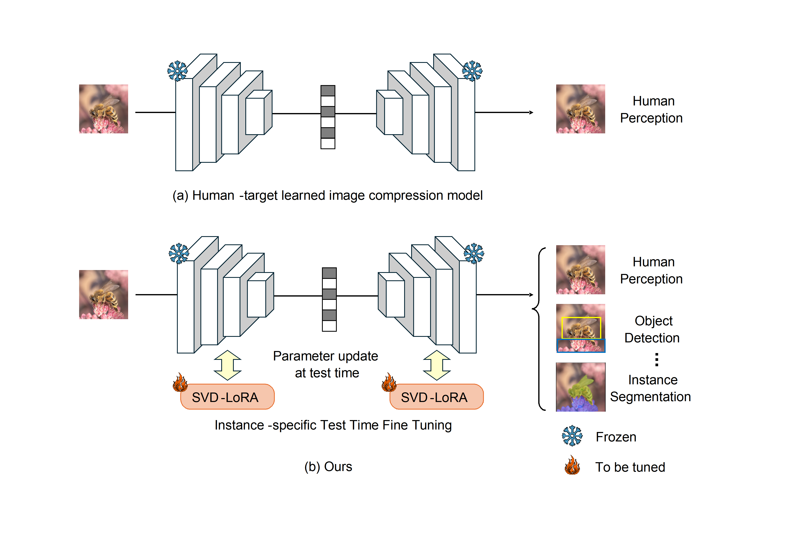

# Test-Time Fine-Tuning of Image Compression Models for Multi-Task Adaptability

This repository contains the source code of our LoRA_comp.

## Abstract
>The field of computer vision initially focused on human visual perception and has progressively expanded to include machine vision. With ongoing technological advancements, this expansion is expected to continue further. Consequently, image compressors must effectively accommodate not only human visual perception but also current (closedset) and future machine vision tasks (open-set). Many recent studies effectively address both human visual perception and closed-set machine vision tasks simultaneously but struggle to handle open-set machine vision tasks. To tackle this issue, this paper proposes a fully instance-specific Test- Time Fine-Tuning (TTFT) approach for adapting Learned Image Compression (LIC) to both closed-set and openset machine tasks effectively. With our method, a largescale LIC model, originally trained for human perception, is adapted to the target task through TTFT using Singular Value Decomposition based Low Rank Adaptation (SVDLoRA). During TTFT, a modified learning scheme is used for the decoder to train only the singular values, preventing excessive bitstream overhead. This enables fully instancespecific optimization for the target task, even for open-set tasks. Experimental results demonstrate that the proposed method effectively adapts the backbone compressor to diverse machine tasks, outperforming competing methods. 

## Dataset
The following datasets are used and needed to be downloaded.
- ImageNet1K
- COCO 2017 Train/Val

## Example Usage 
Specify the mode, task_model, data paths, target rate point, corresponding lambda, and checkpoint in the config file accordingly.

### Classification
`python classification_lora.py` 

### Object Detection
`python detection_segmentation_lora.py task_model=faster_rcnn` 

### Instance Segmentation
`python detection_segmentation_lora.py task_model=mask_rcnn` 

## Ackownledgement
Our work is based on the framework of [CompressAI](https://github.com/InterDigitalInc/CompressAI) and [TransTIC](https://github.com/NYCU-MAPL/TransTIC). We sincerely appreciate the authors for sharing their code openly.
