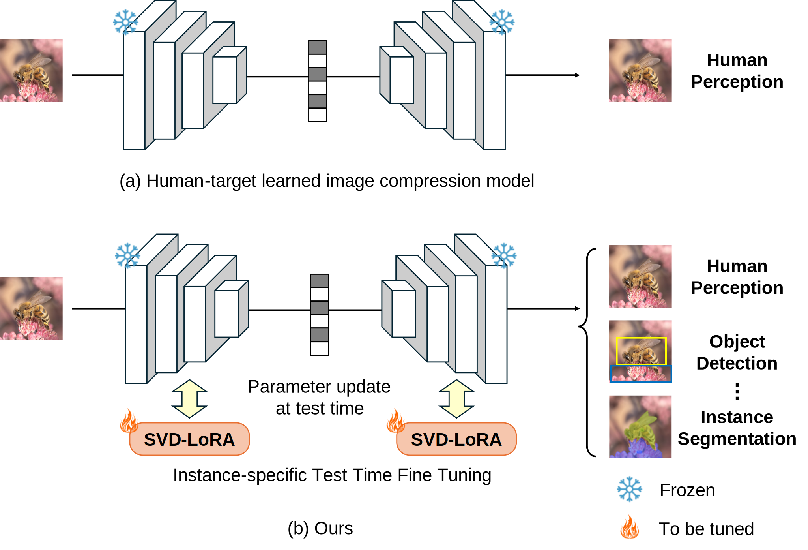
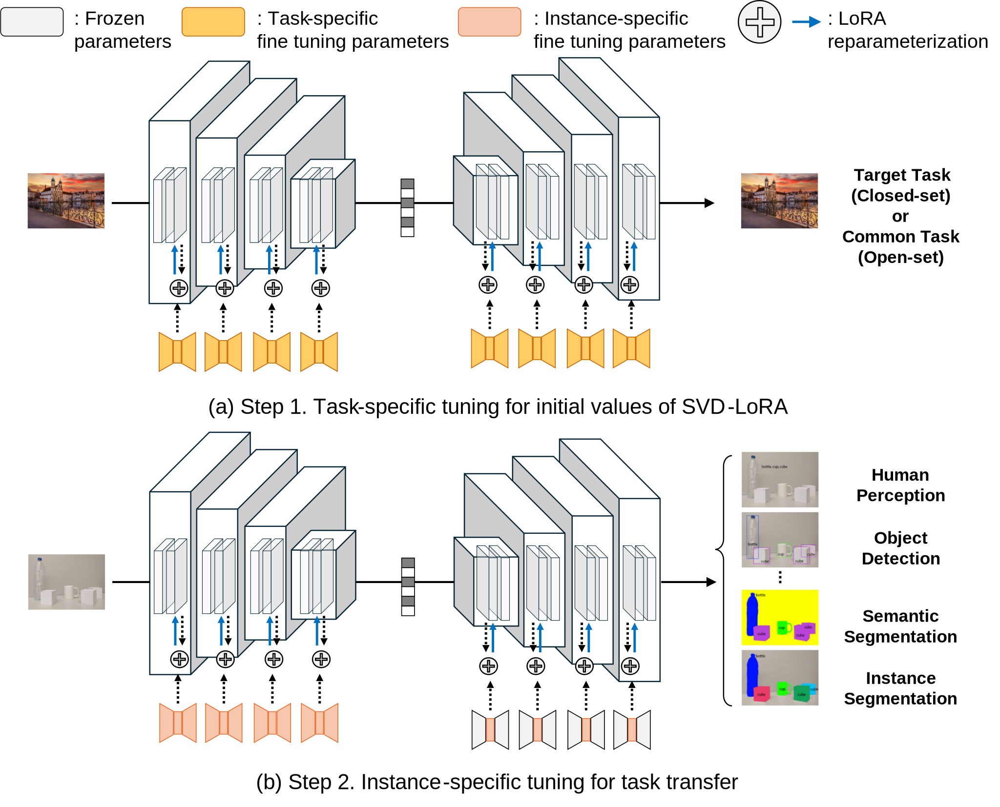
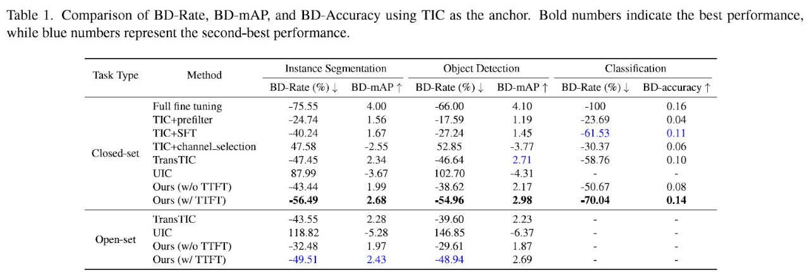

# Test-Time Fine-Tuning of Image Compression Models for Multi-Task Adaptability ( CVPR 2025 )

Official Pytorch code for "Test-Time Fine-Tuning of Image Compression Models for Multi-TaskAdaptability"

<p align="center">

</p>

## Abstract:
>The field of computer vision was initially inspired by the human visual system and has progressively expanded to include a broader range of machine vision applications. Consequently, image compressors should be designed to effectively accommodate not only human visual perception but also machine vision tasks, including closed-set scenarios that enable pre-training and open-set scenarios that involve previously unseen tasks at test time. Many recent studies effectively address both human visual perception and closed-set machine vision tasks simultaneously but struggle to handle open-set machine vision tasks. To address this issue, this paper proposes a fully instance-specific test time fine-tuning (TTFT) for adapting learned image compression (LIC) to both closed-set and open-set machine vision tasks effectively. With our method, a large-scale LIC model, originally trained for human perception, is adapted to the target task through TTFT using Singular Value Decomposition based Low Rank Adaptation (SVD-LoRA). During TTFT, the decoder adopts a modified learning scheme that focuses exclusively on training the singular values, which helps prevent excessive bitstream overhead. This enables fully instance-specific optimization for the target task, even for open-set tasks. Experimental results demonstrate that the proposed method effectively adapts the backbone compressor to diverse machine vision tasks, outperforming competing methods.

## Environment:
- python 3.8
- Pytorch 2.2.2 (CUDA 12.1)

## Getting Started:
Clone this repo. and install the requirements.<br>
```bash
`git clone https://github.com/unkipark/CVPR2025_LoRA_comp.git`
`cd CVPR2025_LoRA_comp`
`./install.sh`
```

## Dataset:
The following datasets are used and needed to be downloaded.
- [ImageNet1K](https://image-net.org/download.php)
- [COCO 2017 Train/Val](https://cocodataset.org/#download)

## Pre-trained weights:
Once downloaded, the archive should be extracted and the contents placed within the `checkpoints` directory.<br>
For example, the classification weights for quality level 1 should be located at `checkpoints/cls/1/checkpoint_best_loss.pth.tar`.<br>
| Tasks                  |       |
|------------------------|-------|
| **Backbone codec (TIC)**   | [Backbone code weight](./checkpoints/base_codec_1.pth) |
| **Human Perception** | [HP weight](./checkpoints/segmentation_1.pth) |
| **Classification**     | [CLS weight](./checkpoints/classification_1.pth) |
| **Object Detection**   | [OD weight](./checkpoints/detection_1.pth) |
| **Instance Segmentation** | [IS weight](./checkpoints/segmentation_1.pth) |

## Usage:
Our method consists of two stages: pre-training and test-time fine-tuning.
To control this behavior, you must modify the `mode` field in each task-specific configuration file located in the config directory.
Specifically, set the mode to "pre" for pre-training and "TTT" for test-time fine-tuning.
Additionally, other settings such as the target rate point, the corresponding lambda value, and the task-specific model can also be configured through the same configuration file.
<p align="center">

</p>

### Classification:
`python example/classification.py`<br>

### Object Detection:
`python example/detection.py`<br>

### Instance Segmentation:
`python example/segmentation.py`<br>

## Performance:
<p align="center">

</p>

## Citation:
If you find our project useful, please cite the following paper:
```bibtex
@inproceedings{LoRA_comp,
  title={Test-Time Fine-Tuning of Image Compression Models for Multi-Task Adaptability},
  author={Unki Park, Seongmoon Jeong, Youngchan Jang, Gyeong-Moon Park4 and Jong Hwan Ko},  
  booktitle={Proceedings of the IEEE/CVF Conference on Computer Vision and Pattern Recognition},
  pages={},
  year={2025}
}
```

## Ackownledgement:
Our work is based on the framework of [CompressAI](https://github.com/InterDigitalInc/CompressAI) and [TransTIC](https://github.com/NYCU-MAPL/TransTIC). We sincerely appreciate the authors for sharing their code openly.
